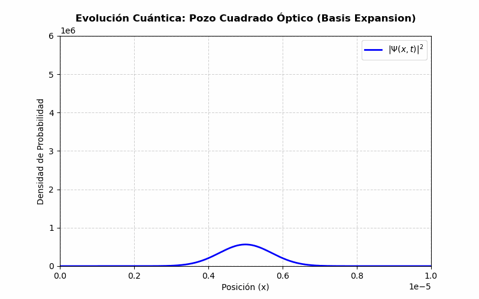
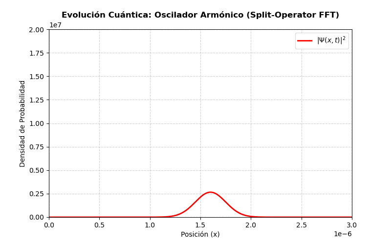

# Numerical Resolution of the Time-Dependent Schrödinger Equation

This repository contains computational models developed in **Python** to simulate quantum state evolution under varying potentials. The models demonstrate advanced numerical integration, matrix diagonalization, and the implementation of Fast Fourier Transforms (FFT) for solving partial differential equations.

## Scripts Included

### 1. `basis_expansion_evolution_squarewell.py`
* **Methodology:** Solves the system using Hamiltonian diagonalization and eigenfunction expansion.
* **Technical Highlights:** * Constructs and diagonalizes the Hamiltonian matrix ($H = H_p + V$).
  * Computes time-evolution using the resulting eigenvectors and eigenvalues.
  * Simulates wave packet dynamics within a defined spatial boundary.

**Simulation Output:**

### 2. `basis_expansion_evolution_harmonicoscillator.py`
* **Methodology:** Implements the Split-Operator (Split-Step) method to simulate temporal evolution in a harmonic potential.
* **Technical Highlights:**
  * Utilizes SciPy's Fast Fourier Transform (`fft` / `ifft`) to efficiently switch between position and momentum spaces.
  * Demonstrates numerical stability for time-dependent evolution and phase space analysis.
  * Highly adaptable framework for arbitrary or time-dependent potentials.

**Simulation Output:**

## Engineering & R&D Applications
While fundamentally quantum physics models, the numerical methods utilized here (FFT, matrix diagonalization, split-step solvers) form the core computational basis for advanced engineering simulations, including wave propagation, computational fluid dynamics (CFD), and structural frequency analysis.
